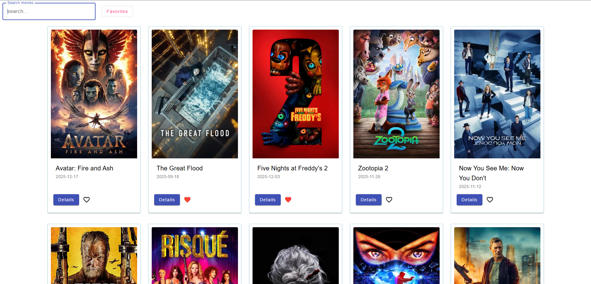

# 🎬 Movie Search App



Цей додаток дозволяє шукати фільми, переглядати їх деталі та зберігати у список улюблених.
Дані беруться з TMDB API.

🔗 **[Подивитись Демо](https://vitiok2021.github.io/movie-search-app/)**

## 🛠 Технології

- **Angular 19** (Signals, Control Flow, Standalone Components)
- **Angular Material** (UI Components)
- **SCSS** (BEM methodology)
- **RxJS**
- **TMDB API**

## 🚀 Функціонал

- 🔥 **Популярні новинки:** Головна сторінка автоматично завантажує список з 20 найпопулярніших фільмів (TMDB Trends).
- 🔍 **Живий пошук:** Можливість знайти будь-який фільм за назвою.
- 📄 **Деталі:** Окремі сторінки з описом, рейтингом та жанром.
- ❤️ **Обране:** Локальне збереження улюблених фільмів (LocalStorage).
- 📱 **Адаптив:** Grid-сітка, яка підлаштовується під мобільні та десктопи.

## 📦 Як запустити локально

1. Клонувати репозиторій:
   ```bash
   git clone [https://github.com/Vitiok2021/movie-search-app.git](https://github.com/Vitiok2021/movie-search-app.git)
   ```
